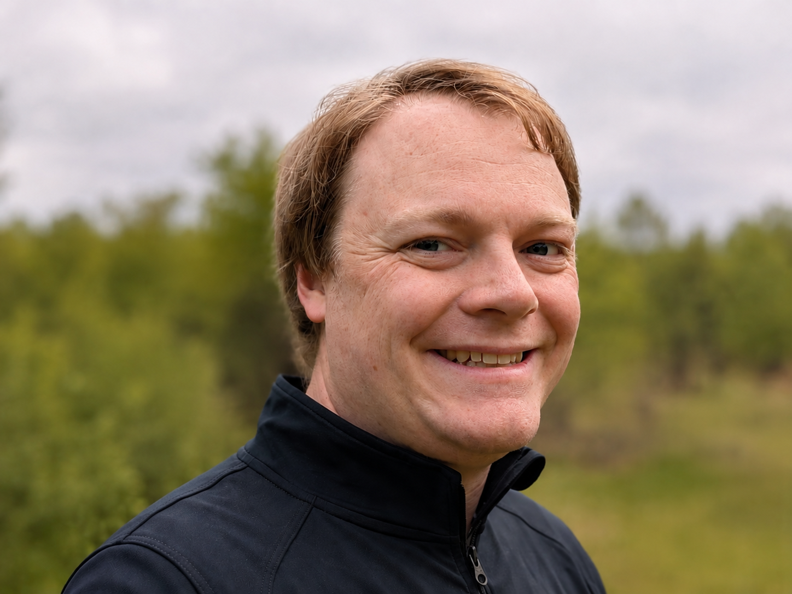

## About Me
I love solving mysteries about our solar system and making new discoveries using orbital dynamics and large-scale telescope data. Currently, I am a Senior Space Situational Awareness Solutions Engineer at [LeoLabs](https://leolabs.space/), a space radar company that helps keep satellites safe through tracking and monitoring. I work on the Data Analytics and Mission Solutions team provide customers with high-quality up-to-date information on their satellites.

Before LeoLabs, I worked for Katlyst Space Technologies and a Senior Astrodynamics Engineer specializing in Space Domain Awareness. I worked on automated satellite characterization and anomaly detection pipelines and software. I was also a part of the mission to rescue the NASA Swift space telescope using a robotic spacecraft. I worked on automating orbit solutions for the LINK spacecraft to help avoid collisions with other satellites. 

I also advise Researchers in [Astronomy and Planetary Science at Northern Arizona University](https://nau.edu/astronomy-and-planetary-science/) in Professor Chad Trujillo's research group on orbital dynamics and telescope surveys of asteroids, comets, and dwarf planets. I received my PhD from NAU and my dissertation was titled *Constraining Planet Location Through Gravitational Modeling* and focused on (1) the relationship between Extreme Trans-Neptunian Objects and a hypothesized distant giant planet in the outer solar system, Planet X; (2) improving the efficiency of orbital characterization for directly imaged exoplanets; and (3) exploring a population of active asteroids/comets called the Quasi-Hildas.

As an undergraduate, I majored in [Physics and Astronomy at Brigham Young University](https://physics.byu.edu/) (with minors in Math, Geology, and Spanish) and worked with Professor Jani Radebaugh on modeling the thermally driven migration of meteorites buried in Antarctic ice. I also worked to determine precise orbits for the moons of the dwarf planet Haumea with Professor Darin Ragozzine and developed curriculum and equipment for undergraduate physics labs.

I love sharing my enthusiasm for space with students through teaching, mentoring, and outreach. When I'm not working, I enjoy spending time with my wife and three kids hiking, disc golfing, and playing board games.

## Research
My research at Katalyst was primarily on orbital dynamics of Earth satellites as part of the Automated Resident Space Object Characterization (ARC) software. I published some of our research at the Advanced Maui Optical and Space Surveillance Technologies Conference (AMOS) [paper](https://amostech.com/TechnicalPapers/2024/SDA/Hofer.pdf) detailing our pipeline for matching uncorrelated observations of satellites with known satellites.

At NAU, I focused on studying active asteroids, a small group of asteroids (~50) that have tails and comae like comets. This work is in connection with the NASA Partner Citizen Science project *Active Asteroids*, where volunteers help us search for cometary activity in archival telescope images. Anyone can participate at [activeasteroids.net](http://activeasteroids.net/) and, so far, we have had thousands of volunteers make millions of classifications and dozens of discoveries! Here is a [paper](https://iopscience.iop.org/article/10.3847/2041-8213/acfcbc/pdf) where I give details on one of our discoveries and here is a [overview paper](https://iopscience.iop.org/article/10.3847/1538-3881/ad1de2/pdf) of the *Active Asteroids* project.

I was also a member of NASA's DART misson, where we hit an asteroid with a spacecraft to change its orbit. It worked great! With enough time to prepare, NASA could deflect dangerous ansteroids on colission courses for Earth. My part on the team was working with images from the James Webb Space Telescope (JWST) taken during the impact. The observations were tricky becasue the asteroid system (Didymos-Dimorphos) was moving quickly across the sky and JWST had to move about 3 times faster than it was originally designed to go. Papers on our inital results from JWST are currently in preparation.

Additional projects I am involved in include: the DECam Ecliptic Exploration Project (DEEP, an observation survey set to discover thousands of new TNOs (see the first of 7 new papers from this project [here](https://arxiv.org/pdf/2309.03417.pdf)), searching for surface features on large TNOs using the Vatican Advanced Technology Telescope and the Large Binocular Telescope, preparation for the Vera C. Rubin observatory through the LSST Solar System Science Collaboration, studying ways of placing constraints on a hypothetical giant planet, Planet X, orbiting deep in the far reaches of our solar system (see my paper [here](https://iopscience.iop.org/article/10.3847/1538-3881/abfb6f)), and follow-up observation for discoveries of new distant TNOs (e.g., [2018 VG18](https://minorplanetcenter.net/mpec/K18/K18Y14.html), the second most distant TNO discovered so far).

For more information on my research and teaching experience, please see my [CV](cv_oct_2026.pdf) and [publications](https://ui.adsabs.harvard.edu/search/filter_author_facet_hier_fq_author=AND&filter_author_facet_hier_fq_author=author_facet_hier%3A%220%2FOldroyd%2C%20W%22&fq=%7B!type%3Daqp%20v%3D%24fq_author%7D&fq_author=(author_facet_hier%3A%220%2FOldroyd%2C%20W%22)&q=%20author%3A%22oldroyd%22&sort=date%20desc%2C%20bibcode%20desc&p_=0).
